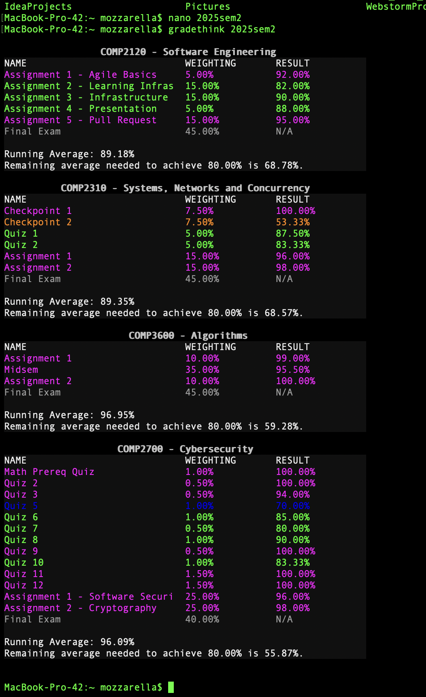

# gradethink

This is a simple CLI tool for students to keep track of, and calculate grades. The current version is able to display names, total weighting and result of components of courses, and colour code them based on various grade bands. This tool is also capable of calculating the running average, and the remaining average that needs to be met in order to achieve a certain gradeband. 



## Tutorial 

Make a text file and format your courses and components in the following style.
``` 
COURSE1:
Component 1, <percentage>, <percentage>
Component 2, <percentage>, <percentage>

COURSE2:
Component 1, <percentage>, <percentage>
Component 2, <percentage>, <percentage>
.
.
.
```
For components, the first column is the component name, the second column is the total weighting, and the last column is **optional**, representing the resulting mark as a percentage in that component. Omitting the last column will have the component be represented internally as uncompleted and thus will not affect various computations like running average. 

Here, `<percentage>` could either be an actual percentage like `60%`, a number like `60`, or a fraction, like `4/5`. If a raw number is given, then a default denominator is used to divide it; the default denominator for the second column is 100, and the default denominator for the last column is `weighting * 100` where `weighting` is the fraction represented by the second column. 

### Example

```
COMP2310:
Checkpoint 1, 7.5%, 7.5/7.5
Checkpoint 2, 7.5%, 4/7.5
Quiz 1, 5%, 21/24
Quiz 2, 5%, 25/30
Assignment 1, 15%, 96%
Assignment 2, 15%, 98%
Final Exam, 45%
```

### Installation & Usage

1. To install gradethink, make sure you are using a UNIX-like operating system (gradethink will most likely not work on Windows). 
2. Then, you may either download the binaries that matches your instruction set, or clone this repository onto your local machine, and compile by running `make`.
3. Move the binary into a path included in your `$PATH` variable.
4. Create a text file for your grades, let's call it `example.txt`.
5. Simply run `gradethink example.txt`.
6. If you want to change the amount of mark you are aiming for, you may run `gradethink example.txt -a [percentage]`, where `[percentage]` is written as a percentage, fraction or raw number. For example, running `gradethink example.txt -a 90%` allows gradethink to speculate the amount of marks you need to reach 90%. 
